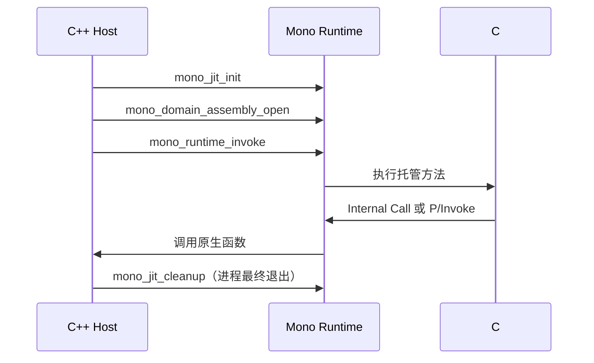

# Mono C++ / C# 嵌入与互操作 API 指南

本文说明如何在 C++ 程序中嵌入 Mono、加载 C# 程序集、调用托管方法，以及让 C# 调回 C++。内容面向经典 `mono/mono` 的 embedding API，尤其适合游戏引擎、工具宿主和插件系统。

> API 签名基线：稳定标签 [`mono-6.12.0.206`](https://github.com/mono/mono/tree/mono-6.12.0.206) 的公开头文件、官方 embedding 文档与 `samples/embed`，并与本仓库自带的 Mono 6.12.0（SGen，x64）头文件交叉核对。维护状态另以 `main` 最后提交 [`0f53e9e`](https://github.com/mono/mono/commit/0f53e9e151d92944cacab3e24ac359410c606df6) 为准。
>
> 项目状态：`mono/mono` 自身的 README 说明，原 Mono 项目最后一次补丁发布于 2024 年 2 月，后续上游维护交由 WineHQ；Microsoft 的现代 Mono fork 位于 `dotnet/runtime`。本文仍适用于需要维护 Mono 6.x embedding ABI 的项目，但新增长期项目应先评估现代 .NET hosting。

稳定标签与 `main` 已经分叉，不能把 `main` 新接口视为 Mono 6.12 可用。例如 6.12 使用返回 `uint32_t` 的旧 `mono_gchandle_*` API，不包含 `main` 后来增加的 GCHandle v2 API。

## 1. 先选对互操作方式

| 需求 | 推荐机制 | 数据边界 | 主要 API |
| --- | --- | --- | --- |
| C++ 加载程序集并调用 C# | Mono embedding API | 直接使用 `MonoObject*`、`MonoString*` 等运行时对象 | `mono_jit_init`、`mono_domain_assembly_open`、`mono_runtime_invoke` |
| 同一宿主内，C# 高频调用 C++ 引擎功能 | Internal Call | 不自动封送；签名必须按 Mono ABI 对齐 | `mono_add_internal_call`、`MethodImplOptions.InternalCall` |
| C# 调用独立原生库，且希望兼容其他 .NET Runtime | P/Invoke | 由 marshaller 转换字符串、结构体、数组和委托 | `DllImport`、`StructLayout`、`MarshalAs` |
| C++ 高频调用固定 C# 方法 | unmanaged thunk，进阶 | 必须精确匹配生成的 ABI | `mono_method_get_unmanaged_thunk` |

一般原则：先用 `mono_runtime_invoke` 做正确的实现；只有性能分析证明调用边界是热点时，再考虑 thunk。对外部原生库优先 P/Invoke；只有宿主和脚本运行时紧耦合时才优先 Internal Call。



## 2. 头文件、链接和运行时目录

### 2.1 常用公开头文件

```cpp
#include <mono/jit/jit.h>
#include <mono/metadata/appdomain.h>
#include <mono/metadata/assembly.h>
#include <mono/metadata/class.h>
#include <mono/metadata/debug-helpers.h>
#include <mono/metadata/image.h>
#include <mono/metadata/loader.h>
#include <mono/metadata/mono-config.h>
#include <mono/metadata/object.h>
#include <mono/metadata/threads.h>
#include <mono/utils/mono-error.h>
#include <mono/utils/mono-publib.h>
```

这些是 C API。公开头文件已经通过 `MONO_BEGIN_DECLS` 处理 C++ 链接，不需要把全部 include 再包一层 `extern "C"`。自己导出给 P/Invoke 的 C++ 函数仍应使用 `extern "C"`，以避免 C++ 名字改编。

不要依赖 `*-internals.h`、结构体私有字段或 `mono/mini` 下的内部实现。源码中的 [`mono/mini/jit.h`](https://github.com/mono/mono/blob/mono-6.12.0.206/mono/mini/jit.h) 会作为安装包中的 `<mono/jit/jit.h>` 暴露；应用代码应包含安装后的公开路径。

### 2.2 Linux / macOS

Mono 2.8 及之后使用 `mono-2` pkg-config ABI 名称：

```bash
c++ -std=c++17 Host.cpp $(pkg-config --cflags --libs mono-2) -o mono-host
mcs -target:library -out:ManagedApi.dll ManagedApi.cs
```

如果 P/Invoke 使用 `DllImport("__Internal")` 查找宿主自身的符号，ELF 平台通常还需要给宿主加 `-rdynamic`，并确保目标函数具有默认可见性。

### 2.3 Windows / 本仓库

本仓库已经提供：

- include：`YaoEngine-core/Dep/Mono/include/mono-2.0`
- import library：`YaoEngine-core/Dep/Mono/lib/mono-2.0-sgen.lib`
- runtime DLL：`YaoEngine-core/Dep/Mono/bin/mono-2.0-sgen.dll`
- BCL：`YaoEngine-core/Dep/Mono/lib/mono`
- config：`YaoEngine-core/Dep/Mono/etc`

MSVC Developer Command Prompt 中的最小命令示例：

```bat
cl /std:c++17 /EHsc Host.cpp ^
  /I YaoEngine-core\Dep\Mono\include\mono-2.0 ^
  /link /LIBPATH:YaoEngine-core\Dep\Mono\lib mono-2.0-sgen.lib

YaoEngine-core\Dep\Mono\bin\mcs.bat ^
  -target:library -out:ManagedApi.dll ManagedApi.cs

copy YaoEngine-core\Dep\Mono\bin\mono-2.0-sgen.dll .
```

宿主、Mono DLL、原生插件和 C# 程序集必须使用相同位数。当前工程的 [`core.lua`](YaoEngine-core/core.lua) 已包含 Mono include/lib 目录并链接 `mono-2.0-sgen`。

## 3. 最小端到端示例：C++ 调 C#，C# 再调回 C++

### 3.1 C#：`ManagedApi.cs`

```csharp
using System.Runtime.CompilerServices;

namespace Demo
{
    internal static class Native
    {
        [MethodImpl(MethodImplOptions.InternalCall)]
        internal static extern void Log(string message);
    }

    public static class Entry
    {
        public static int SumAndLog(int left, int right)
        {
            int sum = checked(left + right);
            Native.Log(string.Format("C# result = {0}", sum));
            return sum;
        }
    }
}
```

编译：

```bash
mcs -target:library -out:ManagedApi.dll ManagedApi.cs
```

### 3.2 C++：`Host.cpp`

```cpp
#include <cstdint>
#include <iostream>
#include <string>

#include <mono/jit/jit.h>
#include <mono/metadata/assembly.h>
#include <mono/metadata/class.h>
#include <mono/metadata/loader.h>
#include <mono/metadata/mono-config.h>
#include <mono/metadata/object.h>
#include <mono/utils/mono-publib.h>

static std::string ToUtf8(MonoString* value)
{
    if (!value)
        return {};

    char* utf8 = mono_string_to_utf8(value);
    std::string result = utf8 ? utf8 : "";
    if (utf8)
        mono_free(utf8);
    return result;
}

static std::string ManagedExceptionText(MonoObject* exception)
{
    MonoObject* stringifyException = nullptr;
    MonoString* text = reinterpret_cast<MonoString*>(
        mono_object_to_string(exception, &stringifyException));

    if (stringifyException || !text)
        return "<failed to stringify managed exception>";
    return ToUtf8(text);
}

// Internal Call 不做字符串封送，所以 C# string 对应 MonoString*。
static void NativeLog(MonoString* message)
{
    std::cout << "[native] " << ToUtf8(message) << '\n';
}

int main(int argc, char** argv)
{
    if (argc != 4) {
        std::cerr << "usage: mono-host <mono-lib-dir> <mono-etc-dir> <assembly>\n";
        return 2;
    }

    // 必须在初始化 Runtime 之前设置可重定位 Mono 的目录并读取配置。
    mono_set_dirs(argv[1], argv[2]);
    mono_config_parse(nullptr);

    MonoDomain* domain = mono_jit_init("MonoEmbedHost");
    if (!domain) {
        std::cerr << "mono_jit_init failed\n";
        return 1;
    }

    mono_add_internal_call(
        "Demo.Native::Log",
        reinterpret_cast<const void*>(&NativeLog));

    MonoAssembly* assembly = mono_domain_assembly_open(domain, argv[3]);
    MonoImage* image = assembly ? mono_assembly_get_image(assembly) : nullptr;
    MonoClass* entry = image
        ? mono_class_from_name(image, "Demo", "Entry")
        : nullptr;
    MonoMethod* method = entry
        ? mono_class_get_method_from_name(entry, "SumAndLog", 2)
        : nullptr;

    if (!method) {
        std::cerr << "assembly, type, or method lookup failed\n";
        mono_jit_cleanup(domain);
        return 1;
    }

    std::int32_t left = 20;
    std::int32_t right = 22;
    void* args[] = {&left, &right}; // 值类型传数据地址。

    MonoObject* exception = nullptr;
    MonoObject* boxedResult =
        mono_runtime_invoke(method, nullptr, args, &exception);

    if (exception) {
        std::cerr << ManagedExceptionText(exception) << '\n';
        mono_jit_cleanup(domain);
        return 1;
    }

    if (!boxedResult) {
        std::cerr << "managed method returned null\n";
        mono_jit_cleanup(domain);
        return 1;
    }

    auto result = *static_cast<std::int32_t*>(mono_object_unbox(boxedResult));
    std::cout << "C++ received " << result << '\n';

    // 只能在确定本进程不会再次初始化 Mono 时调用。
    mono_jit_cleanup(domain);
    return 0;
}
```

Windows 本仓库运行示意：

```bat
Host.exe YaoEngine-core\Dep\Mono\lib YaoEngine-core\Dep\Mono\etc ManagedApi.dll
```

本文编写时已用仓库自带的 Mono 6.12.0、`mcs` 6.12.0.0 和 x64 MSVC 实际编译并运行上述两段代码，得到：

```text
[native] C# result = 42
C++ received 42
```

这个示例展示了完整链路：配置 Runtime → 初始化根域 → 注册 Internal Call → 加载程序集 → 查找类和方法 → 调用并处理异常 → 拆箱返回值 → 最终清理。

## 4. 核心 API 速查

### 4.1 配置和 Runtime 生命周期

| API | 头文件 | 用途与约束 |
| --- | --- | --- |
| `mono_set_dirs(assemblyDir, configDir)` | `assembly.h` | 设置可重定位发行版的 BCL 和配置目录；在 Runtime 初始化前调用。 |
| `mono_config_parse(filename)` | `mono-config.h` | 读取 Mono 配置和 `dllmap`；`nullptr` 表示默认配置。 |
| `mono_jit_parse_options(argc, argv)` | `jit.h` | 应用 JIT 参数；在 `mono_jit_init*` 之前调用。 |
| `mono_jit_init(name)` | `jit.h` | 初始化 Runtime 并创建根 `MonoDomain`。失败返回 `nullptr`。 |
| `mono_jit_init_version(name, version)` | `jit.h` | 显式选择 CLR profile，例如 `v4.0.30319`。 |
| `mono_jit_exec(domain, assembly, argc, argv)` | `jit.h` | 执行程序集入口点 `Main`；适合托管可执行程序宿主。 |
| `mono_get_runtime_build_info()` | `jit.h` | 获取 Runtime build 信息；Mono 6.12 返回调用方拥有的 `char*`，用 `mono_free` 释放。 |
| `mono_jit_cleanup(domain)` | `jit.h` | 最终关闭根域和 Runtime。Mono 6.x 不能在同一进程中可靠地 cleanup 后重新初始化。 |

初始化顺序应固定为：运行时选项/目录 → `mono_config_parse` → `mono_jit_init*` → 注册绑定 → 加载程序集。`mono_jit_cleanup` 只放在进程最终退出路径，不要用于“脚本热重载”。

### 4.2 程序集、镜像和元数据

| API | 返回/所有权 | 用途 |
| --- | --- | --- |
| `mono_domain_assembly_open(domain, path)` | `MonoAssembly*`，Runtime 管理 | 把 `.dll` 或 `.exe` 加载到指定域；失败返回 `nullptr`。 |
| `mono_assembly_get_image(assembly)` | 借用的 `MonoImage*` | 取得程序集元数据镜像；不要单独关闭。 |
| `mono_image_open(path, &status)` | 拥有的 `MonoImage*` | 只读取元数据时打开镜像；用完调用 `mono_image_close`。 |
| `mono_image_strerror(status)` | 借用的 `const char*` | 将 `MonoImageOpenStatus` 转为诊断字符串。 |
| `mono_class_from_name(image, ns, name)` | 借用的 `MonoClass*` | 按命名空间和类型名查找类。嵌套类和泛型名需要使用实际元数据名称。 |
| `mono_class_get_method_from_name(klass, name, argc)` | 借用的 `MonoMethod*` | 按名称和参数数量查方法；同名同参数数量的重载可能有歧义。 |
| `mono_class_get_methods(klass, &iter)` | 借用的 `MonoMethod*` | 遍历方法并检查签名、flags 或元数据。`iter` 初始为 `nullptr`。 |
| `mono_method_desc_new(text, includeNs)` | 拥有的 `MonoMethodDesc*` | 创建描述符进行更精确查找；用完调用 `mono_method_desc_free`。 |
| `mono_method_desc_search_in_class/image` | 借用的 `MonoMethod*` | 在类型或镜像中按描述符查找方法。 |

`MonoAssembly*`、从程序集取得的 `MonoImage*`、`MonoClass*` 和 `MonoMethod*` 通常是 Runtime/Domain 拥有的句柄。它们在所属域卸载后全部失效，不能跨 AppDomain reload 继续缓存。

MethodDesc 的常用格式是 `[Namespace.]Type:Method(argType,...)`，例如 `Game.ScriptHost:Tick(single)` 或 `Game.Widget:.ctor(int,string)`。类型名采用 Mono 元数据描述符语法；先用仓库样例或方法枚举验证描述符，不要把 C# 源码显示名想当然地原样复制。

### 4.3 对象、方法、字段和属性

| API | 用途与注意事项 |
| --- | --- |
| `mono_object_new(domain, klass)` | 只分配对象，不执行构造函数。 |
| `mono_runtime_object_init(obj)` | 执行无参数构造函数。带参数构造函数按普通 `.ctor` 方法查找并 `mono_runtime_invoke`。 |
| `mono_runtime_invoke(method, thisObj, params, &exc)` | 通用调用入口；静态方法的 `thisObj` 为 `nullptr`。 |
| `mono_object_get_virtual_method(obj, baseMethod)` | 解析对象实际类型上的 override；`mono_runtime_invoke` 本身不做虚调用分派。 |
| `mono_object_unbox(obj)` | 返回 boxed value type 内部数据地址；只在对象有效期间立即读取。 |
| `mono_value_box(domain, klass, &value)` | 把原生表示的值装箱为 `MonoObject*`。 |
| `mono_class_get_field_from_name` | 查字段；配合 `mono_field_get_value` / `mono_field_set_value`。 |
| `mono_class_get_property_from_name` | 查属性；属性最终通过 getter/setter 方法执行。 |

实例创建示例：

```cpp
MonoObject* instance = mono_object_new(domain, klass);
if (!instance)
    return;

mono_runtime_object_init(instance); // 仅适用于无参构造。

MonoObject* exception = nullptr;
MonoObject* result = mono_runtime_invoke(method, instance, args, &exception);
```

如需调用基类声明的虚方法，应先解析实际 override：

```cpp
MonoMethod* actual = mono_object_get_virtual_method(instance, baseMethod);
MonoObject* result = mono_runtime_invoke(actual, instance, args, &exception);
```

### 4.4 字符串、数组和内存

| API | 规则 |
| --- | --- |
| `mono_string_new(domain, utf8)` | 从 UTF-8 C 字符串创建托管 `System.String`。 |
| `mono_string_to_utf8(value)` | 返回 Runtime 分配的 UTF-8 缓冲区；必须用 `mono_free`，不能用 `delete`、`free` 或 `g_free`。 |
| `mono_string_to_utf8_checked(value, &error)` | 可报告转换错误的版本；配合 `mono_error_init/ok/get_message/cleanup`。 |
| `mono_array_new(domain, elementClass, length)` | 创建一维数组。 |
| `mono_array_length(array)` | 取得元素数量，类型为 `uintptr_t`。 |
| `mono_array_get/set` | 访问值类型元素的宏。 |
| `mono_array_setref` | 写入引用类型元素并执行 GC write barrier；不要直接写引用数组内存。 |

字符串参数调用示例：

```cpp
MonoString* name = mono_string_new(domain, "YaoEngine");
void* args[] = {name}; // 引用类型直接放 MonoObject*/MonoString*，不是 &name。
MonoObject* result = mono_runtime_invoke(method, instance, args, &exception);
```

若 C# 参数是 `ref string` 或 `out string`，则参数槽需要 `MonoString**`，即 `args[0] = &name`。普通 `string` 与 `ref string` 的传法不能混用。

同理，原生代码向托管对象写引用字段时应使用 `mono_field_set_value` 等公开 API，或使用与该 Runtime 版本匹配的 write barrier API；不要直接覆盖托管堆中的引用地址。

### 4.5 GC Handle

原生全局变量、成员变量和容器不会自动成为 Mono GC root。不要把需要跨帧保存的 `MonoObject*` 裸指针长期缓存起来。

```cpp
std::uint32_t handle = mono_gchandle_new(instance, false); // 强引用，不固定地址。

// 每次使用时重新取得当前地址；移动 GC 后地址可能变化。
MonoObject* current = mono_gchandle_get_target(handle);

mono_gchandle_free(handle);
```

| API | 用途 |
| --- | --- |
| `mono_gchandle_new(obj, pinned)` | 创建强 handle。通常传 `false`；只有必须把内部地址交给原生代码的短时间窗口才 pin。 |
| `mono_gchandle_new_weakref(obj, trackResurrection)` | 创建不阻止回收的弱 handle。 |
| `mono_gchandle_get_target(handle)` | 取当前对象地址；弱引用已回收时返回 `nullptr`。 |
| `mono_gchandle_free(handle)` | 释放 handle；域卸载前应清理该域对象对应的所有 handle。 |

长期 pin 会增加堆碎片并降低 GC 性能。能保存 handle 就不要保存固定地址。

### 4.6 原生线程

`mono_jit_init*` 所在线程已经由 Runtime 管理。宿主自己创建的其他线程，在调用任何 Mono API 或操作托管对象之前必须 attach：

```cpp
void Worker(MonoDomain* domain)
{
    MonoThread* thread = mono_thread_attach(domain);

    // 在这里调用 Mono API / mono_runtime_invoke。

    mono_thread_detach(thread); // 线程退出前，且之后不再接触托管对象。
}
```

不要在域卸载、Runtime cleanup 或线程 detach 后继续使用来自该环境的 `MonoObject*`、`MonoMethod*` 或 thunk。托管回调穿过 C ABI 时必须在托管边界内捕获所有异常，不能让 C# 异常跨过原生栈帧逃逸。

Mono 为 P/Invoke delegate 创建的 reverse-P/Invoke wrapper 会处理原生回调线程的附加；不要再 detach 一个并非由自己 attach 的线程。若原生线程直接调用 `mono_runtime_invoke`、Mono 对象 API 或 unmanaged thunk，仍必须由宿主显式 `mono_thread_attach`，并只对自己 attach 的线程执行 `mono_thread_detach`。

## 5. `mono_runtime_invoke` 参数和返回规则

函数签名：

```cpp
MonoObject* mono_runtime_invoke(
    MonoMethod* method,
    void* thisObject,
    void** parameters,
    MonoObject** exception);
```

### 5.1 `thisObject`

- 静态方法：`nullptr`。
- 引用类型实例方法：`MonoObject*`。
- 值类型实例方法：值数据地址；虚方法等情况可能需要先装箱，具体以方法和 ABI 为准。

### 5.2 `parameters`

| C# 参数 | C++ 参数槽 |
| --- | --- |
| `int value` | `std::int32_t value; args[i] = &value;` |
| `float value` | `float value; args[i] = &value;` |
| `string value` | `MonoString* value; args[i] = value;` |
| `SomeClass value` | `MonoObject* value; args[i] = value;` |
| `ref int value` / `out int value` | 与普通值类型一样传值存储地址；调用后读取该存储。 |
| `ref string value` / `out string value` | `MonoString* value; args[i] = &value;` |
| `ref SomeClass value` | `MonoObject* value; args[i] = &value;` |

`parameters` 可以在无参数方法中传 `nullptr`。不要把 C++ 对象、`std::string`、`std::vector` 或 STL 容器的地址直接交给 Mono。

### 5.3 返回值和异常

- 返回 `void` 时结果通常是 `nullptr`。
- 返回引用类型时，结果就是对应 `MonoObject*`，字符串可解释为 `MonoString*`。
- 返回值类型时，结果被装箱；使用 `mono_object_unbox` 读取。
- `exception` 非空时，调用结果无效，不能再读取。
- 生产代码不要把第四个参数传 `nullptr`；否则托管异常很难被宿主可靠诊断。

`mono_class_get_method_from_name` 只按名称和参数数量筛选。如果存在相同参数数量的重载，应遍历方法并检查 `MonoMethodSignature`，或使用 `MonoMethodDesc`，不要依赖返回顺序。

`mono_method_get_unmanaged_thunk` 是进阶优化，不是把 `MonoMethod*` 随意转换成普通 C 函数。Mono 6.12 的 thunk typedef 需要包含末尾的 `MonoException**` 异常输出参数；Windows 还要按该版本要求匹配 `__stdcall`。值类型、实例参数和装箱规则也必须逐签名核对。ABI 只要有一处不一致就可能直接破坏栈，因此应为每个 thunk 建立编译期 typedef 和运行测试。

## 6. C# 调 C++：Internal Call

Internal Call 适合引擎内部绑定，优点是开销低且能直接接触 Mono 对象；代价是与 Mono Runtime ABI 紧耦合，而且没有 P/Invoke marshalling。

### 6.1 C# 声明

```csharp
using System.Runtime.CompilerServices;
using System.Runtime.InteropServices;

namespace YaoEngine
{
    [StructLayout(LayoutKind.Sequential)]
    internal struct NativeVector3
    {
        internal float X;
        internal float Y;
        internal float Z;
    }

    internal static class InternalCalls
    {
        [MethodImpl(MethodImplOptions.InternalCall)]
        internal static extern void NativeLog(string message);

        [MethodImpl(MethodImplOptions.InternalCall)]
        internal static extern void SetPosition(
            ulong entityId,
            ref NativeVector3 value);
    }
}
```

### 6.2 C++ 实现与注册

```cpp
struct NativeVector3
{
    float x;
    float y;
    float z;
};

static void NativeLog(MonoString* message)
{
    char* utf8 = mono_string_to_utf8(message);
    // ConsumeLog(utf8 ? utf8 : "");
    if (utf8)
        mono_free(utf8);
}

static void SetPosition(std::uint64_t entityId, NativeVector3* value)
{
    if (!value)
        return;
    // Scene::SetPosition(entityId, {value->x, value->y, value->z});
}

void RegisterInternalCalls()
{
    mono_add_internal_call(
        "YaoEngine.InternalCalls::NativeLog",
        reinterpret_cast<const void*>(&NativeLog));
    mono_add_internal_call(
        "YaoEngine.InternalCalls::SetPosition",
        reinterpret_cast<const void*>(&SetPosition));
}
```

关键规则：

- 注册键使用完整的 `Namespace.Type::Method`，大小写必须匹配。
- 推荐只注册 `static extern` 方法，并避免同名重载，减少 ABI 歧义；必须重载时可在键后附加签名，例如 `Namespace.Type::Method(int,string)`，并以实际元数据类型名为准。
- C# `string` 对应 `MonoString*`，类对应 `MonoObject*`，数组对应 `MonoArray*`。
- Internal Call 不封送自定义结构体。结构体使用 `[StructLayout(LayoutKind.Sequential)]`，从 C# 以 `ref`/`out` 传递，在 C++ 接收指针。
- C++ 侧函数的整数宽度、浮点类型、参数顺序和返回类型必须精确匹配。
- C# `bool` 的 Internal Call ABI 使用 8 位 `MonoBoolean`；不要把它与 Mono C API 自身使用的 32 位 `mono_bool`，或与实现相关的 C++ `bool` 混用。
- 原生函数不要让 C++ 异常越过 Mono 边界；在函数内部捕获并转换为错误码或受控的托管异常。

本仓库已有 [`InternalCalls.cs`](YaoEngine-core/Scriptcore/src/Runtime/InternalCalls.cs) 中的 `YaoEngine.InternalCalls.NativeLog(string)` 声明，对应的注册键正是 `YaoEngine.InternalCalls::NativeLog`。

## 7. C# 调 C++：P/Invoke

P/Invoke 更适合稳定 C ABI 和独立原生库。它可以被经典 Mono、Microsoft .NET Framework 和现代 .NET 共用，但必须显式管理 ABI、调用约定和内存所有权。

### 7.1 C++ 导出

```cpp
#include <cstdint>

#if defined(_WIN32)
#define YAO_NATIVE_API extern "C" __declspec(dllexport)
#else
#define YAO_NATIVE_API extern "C" __attribute__((visibility("default")))
#endif

struct NativeVector3
{
    float x;
    float y;
    float z;
};

using EventCallback = void (*)(std::int32_t code);
static EventCallback g_callback = nullptr;

YAO_NATIVE_API std::int32_t yao_add(std::int32_t a, std::int32_t b)
{
    return a + b;
}

YAO_NATIVE_API float yao_sum_vector(const NativeVector3* value)
{
    return value ? value->x + value->y + value->z : 0.0f;
}

YAO_NATIVE_API void yao_set_event_callback(EventCallback callback)
{
    g_callback = callback;
}
```

### 7.2 C# 声明

```csharp
using System;
using System.Runtime.InteropServices;

internal static class NativeApi
{
    // 若函数在宿主可执行文件中并已导出，Mono 扩展名可使用 __Internal。
    // 独立库则改为 "YaoNative"，对应 YaoNative.dll/libYaoNative.so。
    private const string Library = "__Internal";

    [StructLayout(LayoutKind.Sequential)]
    internal struct NativeVector3
    {
        internal float X;
        internal float Y;
        internal float Z;
    }

    [UnmanagedFunctionPointer(CallingConvention.Cdecl)]
    internal delegate void EventCallback(int code);

    [DllImport(Library, EntryPoint = "yao_add",
        CallingConvention = CallingConvention.Cdecl,
        ExactSpelling = true)]
    internal static extern int Add(int a, int b);

    [DllImport(Library, EntryPoint = "yao_sum_vector",
        CallingConvention = CallingConvention.Cdecl,
        ExactSpelling = true)]
    internal static extern float SumVector(ref NativeVector3 value);

    [DllImport(Library, EntryPoint = "yao_set_event_callback",
        CallingConvention = CallingConvention.Cdecl,
        ExactSpelling = true)]
    internal static extern void SetEventCallback(EventCallback callback);

    // 必须保存强引用；否则 GC 后原生端会持有悬空函数指针。
    private static readonly EventCallback CallbackRoot = OnEvent;

    internal static void Initialize()
    {
        SetEventCallback(CallbackRoot);
    }

    private static void OnEvent(int code)
    {
        try
        {
            // 处理原生事件。
        }
        catch (Exception exception)
        {
            // 记录异常，但绝不能让它越过原生回调边界。
            Console.Error.WriteLine(exception);
        }
    }
}
```

P/Invoke 检查表：

- 始终导出 C ABI：`extern "C"`，并显式指定 `CallingConvention`。
- Windows 用 `__declspec(dllexport)`；Unix 确保符号 visibility 和链接器没有裁掉符号。
- `bool` 的 native 宽度容易不一致。跨平台 ABI 优先用 `int32_t`；若必须用布尔值，双方显式声明 `[MarshalAs(UnmanagedType.I1/I4)]` 和对应宽度。
- 结构体显式 `[StructLayout(LayoutKind.Sequential)]`；必要时固定 `Pack` 并在 C++ 用 `static_assert(sizeof(...))` 校验。
- 字符串必须明确编码和所有权。跨平台优先显式 UTF-8；原生返回已分配内存时，必须提供成对的 native free API。
- UTF-8 入参可显式写成 `[MarshalAs(UnmanagedType.LPUTF8Str)] string`，原生侧接收 `const char*`。UTF-16 指针不要写成跨平台 `wchar_t*`；其宽度在 Windows 和 Unix 上可能不同。
- 数组必须传长度；不要假设 C/C++ 能从裸指针知道元素数量。
- 委托传给原生端后必须在 C# 保存强引用，并在销毁原生对象前解除回调。
- `DllImport("__Internal")` 是 Mono 扩展。若需要跨 Runtime 或更稳定的部署，使用独立共享库名称。

## 8. 常用类型映射

| C# | embedding / Internal Call | 稳定 C ABI 建议 |
| --- | --- | --- |
| `byte` / `sbyte` | `std::uint8_t` / `std::int8_t` | `uint8_t` / `int8_t` |
| `short` / `ushort` | `std::int16_t` / `std::uint16_t` | `int16_t` / `uint16_t` |
| `int` / `uint` | `std::int32_t` / `std::uint32_t` | `int32_t` / `uint32_t` |
| `long` / `ulong` | `std::int64_t` / `std::uint64_t` | `int64_t` / `uint64_t` |
| `float` / `double` | `float` / `double` | `float` / `double` |
| `bool` | Internal Call 使用 8 位 `MonoBoolean`；`mono_bool` 是不同的 32 位 API 类型 | 固定宽度整数最稳妥 |
| `char` | `mono_unichar2`（UTF-16 code unit） | `uint16_t` 并明确编码语义 |
| `string` | `MonoString*` | P/Invoke marshalling 或 `const char*` + 明确 UTF-8 |
| `object` / class | `MonoObject*` | opaque handle / `void*`，不要暴露 C++ 对象布局 |
| `T[]` | `MonoArray*` | `T*` + 显式长度 |
| `IntPtr` | `void*` / `intptr_t` | `void*` / `intptr_t` |
| enum | 使用其声明的底层整数类型 | 固定宽度整数 |
| struct | `ref/out` 对应原生指针 | `StructLayout` + C POD struct |

不要把托管 `decimal`、自动布局 class、含引用字段的 struct、`DateTime` 或 C++ STL 类型直接当作二进制兼容结构传递。为边界定义简单、固定宽度、显式布局的数据传输类型。

## 9. AppDomain 与脚本热重载

`mono_jit_cleanup` 不是热重载 API。经典 Mono 常用子 AppDomain 隔离可重载脚本：

1. 进程启动时只创建一次根域。
2. 用 `mono_domain_create_appdomain` 创建脚本域。
3. 用 `mono_domain_set(scriptDomain, false)` 切换当前域，再加载脚本程序集。
4. 缓存属于该域的类、方法和对象，但给缓存标注域/代次。
5. 重载时停止脚本调用，释放该域对象的 GCHandle、委托和原生回调。
6. 切回根域，再调用 `mono_domain_unload(scriptDomain)`。
7. 创建新脚本域并重建全部元数据缓存和对象实例。

域卸载后，旧的 `MonoAssembly*`、`MonoImage*`、`MonoClass*`、`MonoMethod*`、`MonoObject*` 和 thunk 都无效。任何跨域静态状态、后台线程或原生回调都可能阻止安全卸载；热重载流程必须先建立“停止世界”阶段。

AppDomain 是经典 .NET Framework/Mono 模型。现代 .NET 的加载与卸载模型不同，不能直接照搬此 API。

## 10. 错误处理与诊断

建议每一层都检查失败：

- `mono_jit_init*`：检查 `MonoDomain*`。
- `mono_domain_assembly_open`：检查 `MonoAssembly*`；需要更细诊断时用带 `MonoImageOpenStatus` 的打开 API 和 `mono_image_strerror`。
- `mono_assembly_get_image`、`mono_class_from_name`、方法查找：逐级检查，不要让空句柄流入调用 API。
- `mono_runtime_invoke`：始终传 `MonoObject** exception`，异常存在时丢弃 result。
- Internal Call：启动时集中注册并做一次托管 smoke test，避免首次游戏逻辑调用时才发现签名或名称错误。
- P/Invoke：区分 `DllNotFoundException`（库解析失败）、`EntryPointNotFoundException`（导出名失败）和 ABI 崩溃（签名/调用约定错误）。

常见故障：

| 现象 | 优先检查 |
| --- | --- |
| 找不到 `mscorlib` / `System.*` | `mono_set_dirs` 是否在 init 前指向正确的 `lib` 和 `etc`；BCL 是否随包发布。 |
| 找不到程序集 | 使用绝对路径；确认依赖程序集位于可探测目录；确认目标 framework/profile。 |
| 找不到类型或方法 | namespace、大小写、嵌套类型名、参数数量和程序集版本。 |
| Internal Call unresolved | 注册键是否为完整 `Namespace.Type::Method`；是否在首次调用前注册；签名是否重载。 |
| P/Invoke 找不到 DLL | 平台文件名、搜索路径、位数、依赖 DLL、`dllmap` 和 `mono_config_parse`。 |
| 调用后随机崩溃 | 调用约定、结构体 packing、参数宽度、悬空 GC 对象、未 attach 的线程。 |
| 跨帧对象偶发失效 | 是否裸存 `MonoObject*`；改用 `mono_gchandle_new/get_target/free`。 |
| cleanup 后重启失败 | Mono 6.x 不支持同进程可靠重初始化；Runtime 生命周期应与进程一致。 |

不要让宿主和被 P/Invoke 的共享库分别静态链接一份 libmono，否则同一进程可能出现两个 Runtime 实例。C++ RAII 封装也必须在 `mono_jit_cleanup` 前析构；尤其不要让静态对象在 Runtime 已关闭后再释放 GCHandle 或调用 Mono API。

## 11. 在 YaoEngine 中的落地位置

当前仓库已具备基本依赖配置，但原生脚本引擎文件尚未形成实现。建议按以下职责组织：

| 位置 | 建议职责 |
| --- | --- |
| [`YaoEngine-core/src/core/ScriptEngine/ScriptEngine.h`](YaoEngine-core/src/core/ScriptEngine/ScriptEngine.h) | `Init`、`Shutdown`、程序集加载、类/方法缓存、实例 GCHandle、域代次等公开接口。 |
| [`YaoEngine-core/src/core/ScriptEngine/ScriptEngine.cpp`](YaoEngine-core/src/core/ScriptEngine/ScriptEngine.cpp) | Runtime 初始化、`mono_set_dirs`、程序集/类型/方法查找、invoke、异常转换、Internal Call 注册。 |
| [`YaoEngine-core/Scriptcore/src/Runtime/InternalCalls.cs`](YaoEngine-core/Scriptcore/src/Runtime/InternalCalls.cs) | 仅放 `static extern` 原生绑定声明；保持小型、固定 ABI。 |
| [`YaoEngine-core/Scriptcore/src/Runtime/ScriptBehaviour.cs`](YaoEngine-core/Scriptcore/src/Runtime/ScriptBehaviour.cs) | 面向脚本作者的安全托管封装，不直接暴露 Mono 细节。 |
| [`YaoEngine-core/core.lua`](YaoEngine-core/core.lua) | Mono include/lib/link 配置以及部署 Runtime DLL、BCL、config。 |

建议的启动顺序：

1. 解析项目目录和 `Dep/Mono` 的绝对路径。
2. `mono_set_dirs(lib, etc)`、`mono_config_parse(nullptr)`。
3. `mono_jit_init_version("YaoEngine", "v4.0.30319")`。
4. 集中执行 `RegisterInternalCalls()`。
5. 加载 `ScriptCore.dll`，缓存 `ScriptBehaviour` 生命周期方法。
6. 加载用户程序集，为每个实体创建实例并用非 pinned GCHandle 保存。
7. 每帧从 handle 取当前对象，调用缓存的 `OnUpdate(float)`。
8. 引擎最终退出时先停止脚本线程/回调、释放 handles，再 `mono_jit_cleanup`。

不要让渲染线程、任务线程或文件监控线程直接共享裸 `MonoObject*`。把跨线程脚本调用汇入一个已 attach、生命周期明确的脚本执行线程，或者为每个调用线程建立严格的 attach/detach 约束。

## 12. 上线前检查表

- [ ] Runtime 只初始化一次，cleanup 只发生在进程最终退出。
- [ ] 所有查找 API 都检查了 `nullptr`。
- [ ] 所有 `mono_runtime_invoke` 都捕获并记录托管异常。
- [ ] 值类型参数传地址，引用类型参数传对象指针，`ref` 引用传指针的地址。
- [ ] `mono_string_to_utf8` 的结果全部用 `mono_free` 释放。
- [ ] 跨帧对象全部使用 GCHandle，普通 handle 不滥用 pinned。
- [ ] 所有宿主创建的 Mono 调用线程都 attach/detach。
- [ ] Internal Call 注册名、C# 声明和 C++ ABI 有自动化 smoke test。
- [ ] P/Invoke 使用 C ABI、显式调用约定、固定宽度类型和明确内存所有权。
- [ ] 域卸载前停止调用、释放 handles/委托，并清空全部旧域缓存。
- [ ] Windows 发布包包含 `mono-2.0-sgen.dll`、`lib/mono`、`etc` 和托管依赖。
- [ ] Debug/Release/Dist 与 x86/x64/ARM 的宿主、Mono、插件、程序集配置一致。

## 13. 上游来源

- [`mono/mono` README 与维护状态](https://github.com/mono/mono/blob/0f53e9e151d92944cacab3e24ac359410c606df6/README.md)
- [官方 Embedding Mono 指南](https://www.mono-project.com/docs/advanced/embedding/)
- [官方 P/Invoke / native interop 指南](https://www.mono-project.com/docs/advanced/pinvoke/)
- [仓库中的 embedding API 文档源](https://github.com/mono/mono/blob/mono-6.12.0.206/docs/sources/mono-api-embedding.html)
- [GCHandle 文档源](https://github.com/mono/mono/blob/mono-6.12.0.206/docs/sources/mono-api-gchandle.html)
- [最小 Internal Call 示例：`teste.c`](https://github.com/mono/mono/blob/mono-6.12.0.206/samples/embed/teste.c) / [`test.cs`](https://github.com/mono/mono/blob/mono-6.12.0.206/samples/embed/test.cs)
- [对象、字段、属性、异常与 invoke 示例：`test-invoke.c`](https://github.com/mono/mono/blob/mono-6.12.0.206/samples/embed/test-invoke.c) / [`invoke.cs`](https://github.com/mono/mono/blob/mono-6.12.0.206/samples/embed/invoke.cs)
- [Runtime 生命周期公开声明：`mono/mini/jit.h`](https://github.com/mono/mono/blob/mono-6.12.0.206/mono/mini/jit.h)
- [程序集 API：`assembly.h`](https://github.com/mono/mono/blob/mono-6.12.0.206/mono/metadata/assembly.h)、[类 API：`class.h`](https://github.com/mono/mono/blob/mono-6.12.0.206/mono/metadata/class.h)、[对象/调用/GCHandle API：`object.h`](https://github.com/mono/mono/blob/mono-6.12.0.206/mono/metadata/object.h)
- [公开 ABI 基础类型与 C++ linkage：`mono-publib.h`](https://github.com/mono/mono/blob/mono-6.12.0.206/mono/utils/mono-publib.h)
- [WineHQ Mono 上游](https://gitlab.winehq.org/mono/mono) 与 [Microsoft `dotnet/runtime` Mono fork](https://github.com/dotnet/runtime/tree/main/src/mono)
